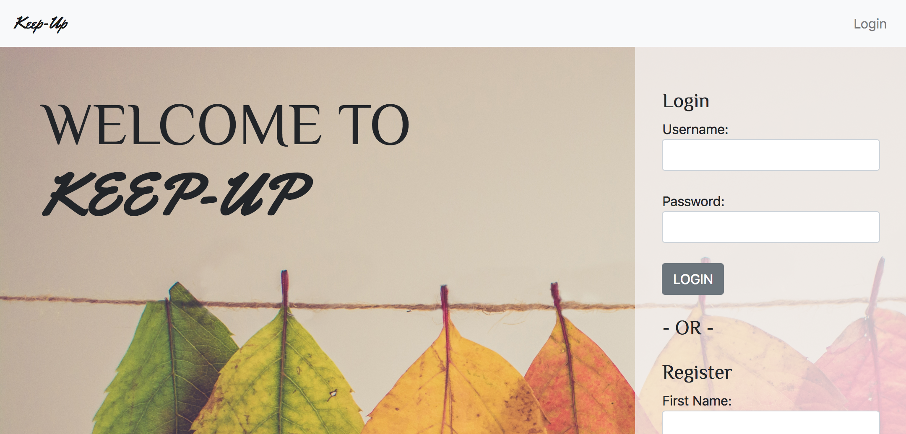

# Keep-Up

Keep-Up is in it's infacny stages. It is a budgeting project I started for my backend Capstone project at NSS. It allows users to track purchase for certain occasions to ensure they stay on budget. 



Users can create occasions that may need a budget.


Users can also track Purchases and link a Purchase to a particular Occasion.


They can then review their budget against what they have spent for their Occasion.


# Tools Used:

- HTML
- Sass
- Bootstrap
- JQuery
- AngularJS
- Express
- Sequelize
- Node.js
- PostgreSQL

# Fork or Download

Fork or download the Keep-Up repo then follow these instructions while in the directory:

```
npm install
node build-db.js
npm run dev
```
